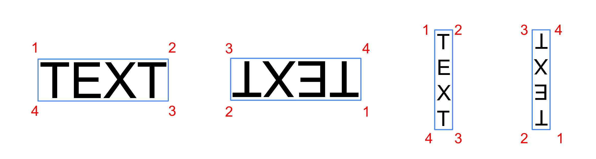

# The HierText Dataset


## Overview

HierText is the first dataset featuring hierarchical annotations of text in
natural scenes and documents. The dataset contains 11639 images selected from
the
[Open Images dataset](https://storage.googleapis.com/openimages/web/index.html),
providing high quality word (~1.2M), line, and paragraph level annotations. Text
lines are defined as connected sequences of words that are aligned in spatial
proximity and are logically connected. Text lines that belong to the same
semantic topic and are geometrically coherent form paragraphs. Images in
HierText are rich in text, with average of more than 100 words per image.

We hope this dataset can help researchers developing more robust OCR models and
enables research into unified OCR and layout analysis. Check out our
[paper](https://arxiv.org/pdf/2203.15143.pdf) for more details.

## Getting Started

First clone the project:

```
git clone https://github.com/google-research-datasets/hiertext.git
```

(Optional but recommended) Create and enter a virtual environment:

```
sudo pip install virtualenv
virtualenv -p python3 hiertext_env
source ./hiertext_env/bin/activate
```

Then install the required dependencies using:

```
cd hiertext
pip install -r requirements.txt
```

### Dataset downloading & processing

The ground-truth annotations of `train` and `validation` sets are stored in
`gt/train.jsonl.gz`, `gt/validation.jsonl.gz` respectively. Use the following
command to decompress the two files:

```
gzip -d gt/*.jsonl.gz
```

The images are hosted by [CVDF](http://www.cvdfoundation.org/). To download them
one needs to install
[AWS CLI](https://docs.aws.amazon.com/cli/latest/userguide/getting-started-install.html)
and run the following:

```
aws s3 --no-sign-request cp s3://open-images-dataset/ocr/train.tgz .
aws s3 --no-sign-request cp s3://open-images-dataset/ocr/validation.tgz .
aws s3 --no-sign-request cp s3://open-images-dataset/ocr/test.tgz .
tar -xzvf train.tgz
tar -xzvf validation.tgz
tar -xzvf test.tgz
```

### Dataset inspection and visualization

Run the visualization notebook locally to inspect the data using:

```
jupyter notebook HierText_Visualization.ipynb
```

## Dataset Description

We split the dataset into `train` (8281 images), `validation` (1724 images) and
`test` (1634 images) sets. Users should train their models on `train` set,
select the best model candidate based on evaluation results on `validation` set
and finally report the performance on `test` set.

There are five tasks:

-   Word-level
    -   Word detection (polygon)
    -   End-to-end
-   Line-level
    -   Line detection (union of words)
    -   End-to-end
-   Paragraph detection (union of words)

### Images

Images in HierText are of higher resolution with their long side constrained to
1600 pixels compared to previous datasets based on Open Images that are
constrained to 1024 pixels. This results in more legible small text. The
filename of each image is its corresponding image ID in the Open Images dataset.
All images are stored in JPG format.

### Annotations

The ground-truth has the following format:

```jsonc
{
  "info": {
    "date": "release date",
    "version": "current version"
  },
  "annotations": [  // List of dictionaries, one for each image.
    {
      "image_id": "the filename of corresponding image.",
      "image_width": image_width,  // (int) The image width.
      "image_height": image_height, // (int) The image height.
      "paragraphs": [  // List of paragraphs.
        {
          "vertices": [[x1, y1], [x2, y2],...,[xn, yn]],  // A loose bounding polygon with absolute values.
          "legible": true,  // If false, the region defined by `vertices` are considered as do-not-care in paragraph level evaluation.
          "lines": [  // List of dictionaries, one for each text line contained in this paragraph. Lines in paragraph may not follow the reading order.
            {
              "vertices": [[x1, y1], [x2, y2],...,[x4, y4]],  // A loose rotated rectangle with absolute values.
              "text": "the text content of the entire line",
              "legible": true,  // A line is legible if and only if all of its words are legible.
              "handwritten": false,  // True for handwritten text, false for printed text.
              "vertical": false,  // If true, characters have a vertical layout.
              "words": [  // List of dictionaries, one for each word contained in this line. Words inside a line follows the reading order.
                {
                  "vertices": [[x1, y1], [x2, y2],...,[xm, ym]],  // Tight bounding polygons. Curved text can have more than 4 vertices.
                  "text": "the text content of this word",
                  "legible": true,  // If false, the word can't be recognized and the `text` field will be an empty string.
                  "handwritten": false,  // True for handwritten text, false for printed text.
                  "vertical": false,  // If true, characters have a vertical layout.
                }, ...
              ]
            }, ...
          ]
        }, ...
      ]
    }, ...
  ]
}
```

-   Lines in a paragraph may not follow the reading order while words inside a
    line are ordered respect to the proper reading order.

-   Vertices in the ground-truth word polygon follow a specific order. See the
    below figure for details.



## Evaluation

Uses the following command for word-level detection evaluation:

```
python3 eval.py --gt=gt/validation.jsonl --result=/path/to/your/results.jsonl --output=/tmp/scores.txt --mask_stride=1
```

Add `--e2e` for end-to-end evaluation. Add `--eval_lines` and
`--eval_paragraphs` to enable line-level and paragraph-level evaluation.
Word-level evaluation is always performed.

Be careful when you set the `mask_stride` parameter. Please read the flag's
definition. For results intended to be included in any publications, users are
required to set `--mask_stride=1`.

To expedite the evaluation, users can also set the `num_workers` flag to run the
job in parallel. Note that using too many workers may result in OOM.

Your predictions should be in a `.jsonl` file with the following format, even
for word-level only evaluation, in which case a paragraph can contain a single
line which contains a single word. For detection only evaluation, `text` can be
set to an empty string.

```jsonc
{
  "annotations": [  // List of dictionaries, one for each image.
    {
      "image_id": "the filename of corresponding image.",
      "paragraphs": [  // List of paragraphs.
        {
          "lines": [  // List of lines.
            {
              "text": "the text content of the entire line",  // Set to empty string for detection-only evaluation.
              "words": [  // List of words.
                {
                  "vertices": [[x1, y1], [x2, y2],...,[xm, ym]],
                  "text": "the text content of this word",  // Set to empty string for detection-only evaluation.
                }, ...
              ]
            }, ...
          ]
        }, ...
      ]
    }, ...
  ]
}
```

**NOTE** In evaluation, lines and paragraphs are defined as the union of
pixel-level masks of the underlying word level polygons.

### Sample output on the validation set

We attached a sample output file in compressed form, `sample_output.jsonl.gz`,
to this repo. Use `gzip -d sample_output.jsonl.gz` to uncompress it and pass to
`--result`. You should be able to see the scores as those in
`sample_eval_scores.txt`. These are the outputs and results on the validation
set of the Unified Detector (line based) model proposed in our paper. Note the
results are different from the ones reported in the paper which are computed on
the test set.

### Evaluation on the test set

We plan to host a competition soon. Before that happens, please send your
compressed (e.g. using gzip) JSON file to hiertext@google.com. We will run the
evaluation and provide the results within a week. In the email, please also
provide the team's name, organization, the tasks to be evaluated on and a short
description about the method.

By emailing us and by submitting your prediction files, you consent to being
contacted by the HierText team about your submission and allowing us to use your
predictions to potentially fix ground-truth errors. The submitted files will be
kept for 180 days unless requested by the authors.

## License

The HierText dataset are released under
[**CC BY-SA 4.0**](https://creativecommons.org/licenses/by-sa/4.0/) license.

## BibTeX

Please cite our [paper](https://arxiv.org/pdf/2203.15143.pdf) if you use the
dataset in your work:

```
@inproceedings{long2022towards,
  title={Towards End-to-End Unified Scene Text Detection and Layout Analysis},
  author={Long, Shangbang and Qin, Siyang and Panteleev, Dmitry and Bissacco, Alessandro and Fujii, Yasuhisa and Raptis, Michalis},
  booktitle={Proceedings of the IEEE/CVF Conference on Computer Vision and Pattern Recognition},
  year={2022}
}
```

**This is not an officially supported Google product.** If you have any
question, please email us at hiertext@google.com.

